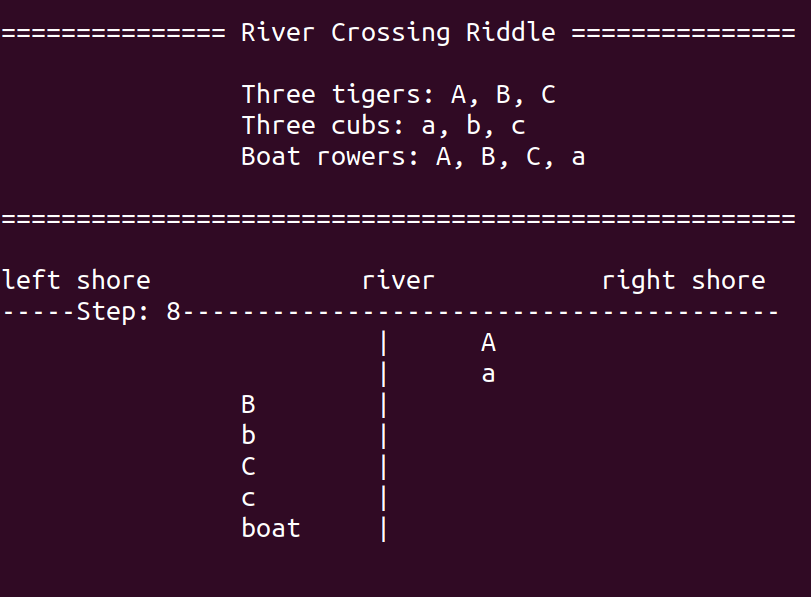
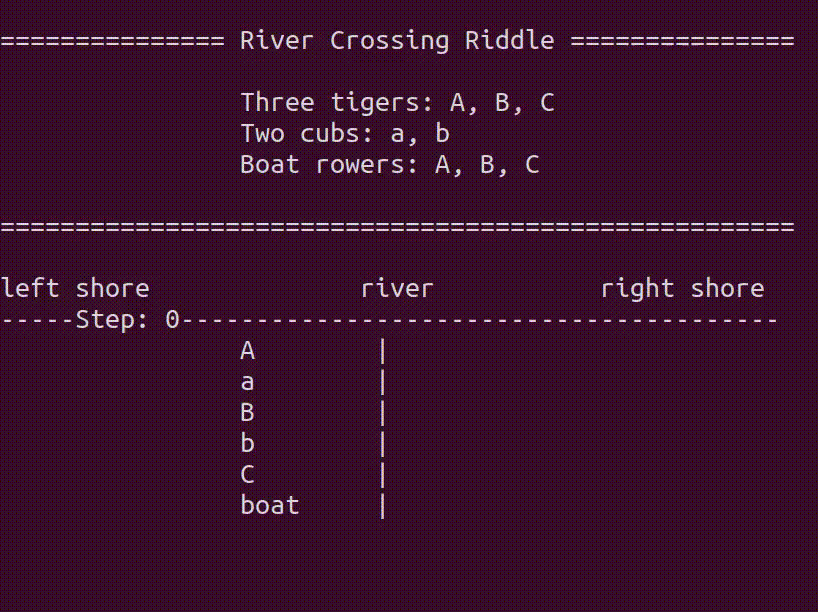
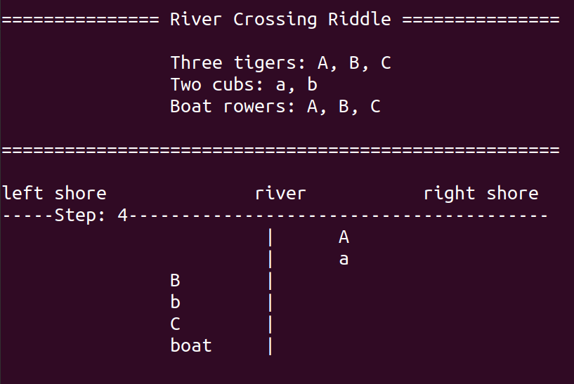

# Cracking a Rural Chinese Riddle with Computer Science
\toc
## Background
This mini-project started during my trip in China as my way of connecting with my grandparents.

I haven't visited them in 6 years, and I've forgotten nearly all of my Chinese.
I tried to show them some pictures, but age hasn't been kind to their eyes.

Still wishing to communicate, I decided to demonstrate my abilities as a programmer by cracking one of the riddles they used to give me as a kid.

Here it is:
$$
\begin{align}
&\textbf{The River Crossing Riddle} \notag \\
\notag \\
&\text{There are three tigers and three cubs.} \notag \\
&\text{Each tiger is a parent to exactly one of the cubs.} \notag \\
\notag \\
&\text{The tigers and cubs are trying to cross a river.}\notag \\
&\text{There is a boat next to the shore capable of carrying at most two animals at a time.}\notag \\
&\text{All three tigers know how to row the boat, but only one of the cubs knows, the other two cubs can only be passengers.}\notag \\
\notag \\
&\text{The tigers are merciless and will eat any cub that is not with its parent.}\notag \\
&\text{For example, 'tiger A' will eat 'cub b' if 'tiger B' is on the other side of the river.}\notag \\
\notag \\
&\text{How does the entire group cross the river safely?}\notag \\
\end{align}
$$

For whatever reason, this particular riddle captured my attention. 
I remember spending many hours working on it before eventually solving it.
Then I would inevitably forget the solution (because it was long and involved), which prompts my grandparents to give me the riddle again.
Eventually, it sort of became our favourite riddle.

I just felt so clever and satisfied after getting the solution, and it never went away no matter how many times I redid it.
But, knowing what I know now, I was doing nothing more than manually running a brute-force algorithm, which I knew I can automate with breadth-first search.

Cracking this problem open and solving not only this particular riddle but also every other possible variant is a perfect way to demonstrate what I spend my time on to my grandparents in a way which they can understand and connect with.

## Solution: Graph Discovery + Breadth-first Search
This riddle has a finite number of states.

Of those states, there are those that can be reached AND where everyone is alive.
And there are those that cannot be reached OR where somebody is dead.
We'll call the former states 'valid' and the latter 'invalid'.

The riddle defines a game whose rules tell us how to go from the valid state we are on to any other neighboring valid states.

We're essentially traversing a graph, where we wish to find the shortest path from the starting state, where everything is on the left shore, to the solution state, where everything is on the right shore.

This can be done with the breadth-first search algorithm.
That is pretty much all there is to it

I encourage you to try the riddle for yourself first, then use the following gif to check that you got the right solution!

~~~

    

~~~

## Quest for a Simpler Variant
To further demonstrate my powers to my unsuspecting grandparents, I searched the space of all possible riddles to find different variants.
I wanted the variant I present to my grandparents to satisfy two conditions.

1. A simpler version requiring less steps in the solution
1. Still gave the same sense of cleverness and satisfaction once solved

The version I was given was too difficult, it involved running a brute-force algorithm by hand for 13 steps.
Indeed, in my whole family, only I was foolish enough to give up my time to find the solution, which seems predictive of the profession I am in now.

Now that I have nieces of my own, I wanted to give them an easier variant of the riddle, but one that still gave the sense of solving something tricky.

The tricky part was figuring out what seemed tricky about the riddle, and why it gave me the sense of being clever after having found the solution.
It can't feel like you are carrying out a mindless algorithm, like multiplying two long numbers, where is the fun in that?

After investigating further, I believe I found the culprit, and it has more to do with human psychology than the actual difficulty of the problem (as we come to expect).

Take a look at step 8 in the solution.

~~~

    

~~~

If you squint a little, the state of the game at step 8 looks like a state you can reach immediately in step 1.
Manually running the search algorithm is difficult because you have to keep track of all the states you've visited before.
This requires solid bookkeeping, which we tend to disregard in our impatience.

One of the first thing we tend to do is to stop tracking the location of the boat.
Maybe we see the boat as less of a prominent character than the tigers/cubs or we think, quite arrogantly, that we'll surely remember which shore the boat is on, but the location of the boat is the first thing we mess up.

When the location of the boat is even slightly questioned, it throws up a psychological barrier once we hit step 8.
Either we don't recognize the state at step 8 as being an uniquely distinguishable state, or we've just thrown enough doubt that we lose confidence in the accuracy of our bookkeeping, both will hinder our progress to the solution.

This is the main barrier of the riddle.
In fact, once we confidently progress in our search after step 8, the solution becomes almost immediately evident.

When looking for a variant of the riddle, we must hit the same psychological barrier in order to give us the same satisfaction for persevering through the uncertainty.
I believe I found the simpler variant of the riddle I have been looking for.
$$
\begin{align}
&\textbf{The River Crossing Riddle (Simpler Variant)} \notag \\
\notag \\
&\text{There are three tigers and two cubs.}\notag \\
&\text{Each tiger is a parent to exactly one of the cubs, leaving the last cub without a parent.}\notag \\
\notag \\
&\text{The tigers and cubs are trying to cross a river.}\notag \\
&\text{There is a boat next to the shore capable of carrying at most two animals at a time.}\notag \\
&\text{Only the tigers know how to row the boat, the cubs can only be passengers.}\notag \\
\notag \\
&\text{The tigers are merciless and will eat any cub that is not with its parent.}\notag \\
&\text{For example, 'tiger A' will eat 'cub b' if 'tiger B' is on the other side of the river.}\notag \\
\notag \\
&\text{How does the entire group cross the river safely?}\notag \\
\end{align}
$$

The solution to this simpler variant involves 7 steps as opposed to the 13 steps required in the original version.

~~~

    

~~~

The psychological barrier arises in step 4, and I can confirm that it is indeed a barrier as my grandpa just couldn't get past it =)

~~~

    

~~~
